# Documentação Geral:

# Sistema de reserva de passagens aéreas

## Integrantes 

Gabriel Eduardo (BackEnd) 

João Vitor Paiva (Testador) 

Matheus Teles (Frontend) 

Victor Alves (Lider/Documentador)

Yan Santos (Analista de Sistema) 

## Introdução

“Dos 29 milhões de idosos brasileiros, apenas 5 milhões estão conectados à internet”, segundo pesquisa feita pelo 
G1. Isso reflete os problemas que nosso país vive de integrar as gerações mais antigas ao mundo digital. Hoje muita coisa 
acontece dentro desse universo, mas muitos ainda estão fora dessa realidade. Dentre muitos fatores para a exclusão digital dos 
idosos, aponta-se a dificuldade de interagir com as interfaces tecnológicas complexas e pouco intuitivas como um dos 
principais pontos.

Pensando nisso, o modelo(protótipo) de sistema de reserva de passagens aéreas se preocupou em dar uma atenção maior a essas 
pessoas, garantindo uma maior acessibilidade a todos os públicos.

## Objetivos 

Facilidade de navegação: Fornecer ao usuário uma melhor experiência durante a reserva com uma plataforma mais direta e eficiente. 

Otimização de tarefas: a partir da compactação de tarefas, otimizar os diversos serviços envoltos à reserva. 

## Modelagem Inicial: 

## Modelagem Final: 

## Principais Comentários ao longo do projeto:

*04/06/2024* - Formando  o grupo e começando a discutir algumas ideias de como seria o projeto, quais problemas e suas possíveis soluções.

*22/06/2024* - Selecionado a ideia de criar um Sistema de Reserva  de Pasagens Aéres.
Discusso no grupo de como será as possíveis Classes e quais métodos serão utilizados em cada um e como será o projeto,pois no começo não havia a ideia de qual projeto poderia ser feito.

*23/06/2024* - Detalhamento de cada etapa de forma ampla:
"• Pensar no projeto como início - meio - fim 
• Descrição do problema que resolveremos 
• ⁠Objetivo Geral do Projeto 
• ⁠Objetivo Particular de cada parte do projeto 
• ⁠O que deve ser feito por cada pessoa e até prazo
• ⁠Tentar rascunhar algum diagrama de classe 
• ⁠Exemplos do projeto “rodando”"

*24/06/2024* - Primeira reunião do grupo pela plataforma do Discord onde discutiu cada etapa acima e como seria as Classes.

*01/07/2024* - Rabisco de algumas Classes com métodos e atributos:

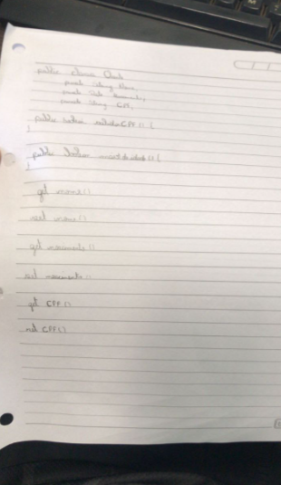
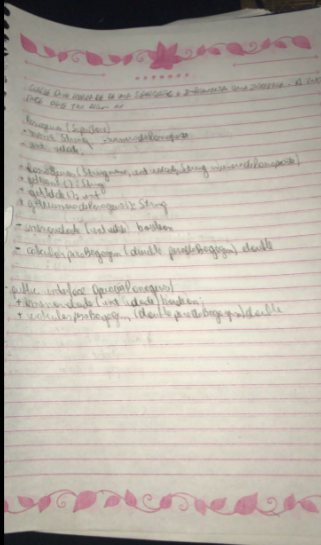
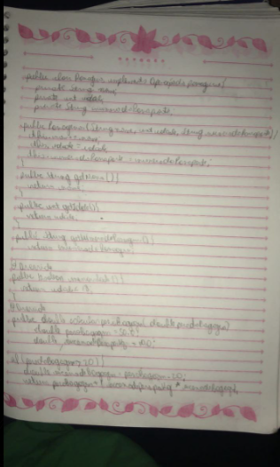
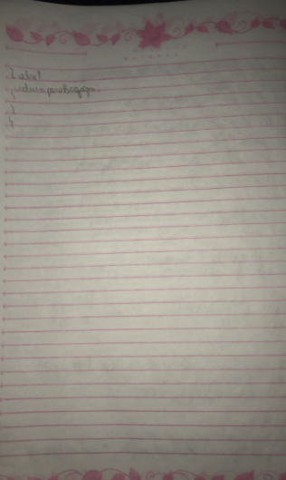
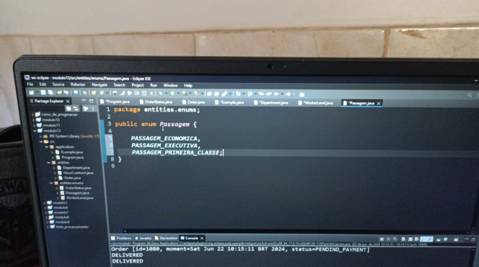

*02/07/2024* - Agendamento de outra reunião  às 21:00 para começar o projeto e finalizar a etapa 1 .

*03/07/2024* - Os integrantes Yan Santos e Gabriel Eduardo avisam ao grupo para entrar no repositório, pois os demais tiveram dificuldade de acesso ao Repositório do Grupo 2.

*05/07/2024* - Foi marcado outra Reunião do projeto para conseguir finalizar a primeira etapa do projeto.

*07/07/2024* - Foi realizado outra reunião para finalizar a etapa 1 do projeto e cocnluir algumas outras partes.
Inicio do planejamento e inicialização de algumas classes, como: Aeronave, Voo, Menu, Aviao e Passageiro:

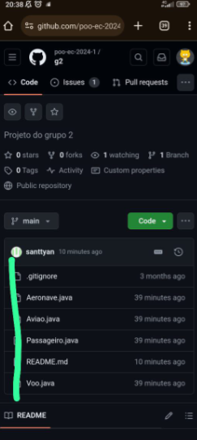

*08/07/2024* - Marcação de outra reunião antes das 10:00 horas
Yan Santos ficou responsável por fazer o arquivo UML
e foi marcada outra reunião para começar  o projeto e escrever as classes e como iriam se relacionar
Planejamento finalizado, a foto do  diagrama e algumas partes do  código.
Alguns membros não conseguiram participar, pois faltou energia em sua moradia e internet.
Projeto quase finalizado faltando apenas conectar no Banco de Dados, Criar a Interface e algumas pequenas partes.
Finalização da Etapa 1 do projeto.

## Foto

*09/07/2024* - Inicialização da parte 2 do Projeto.
Professor Akira apontou alguns erros durante a apresentação das Classes e Métodos
Agendamento de outra Reunião para finalizar a Classe Main, Interface, alterar o diagrma UML e implementação do README.
Criação de um projeto Teste para ver o que falta, experimentando cada parte e analizando cada parte.

*19/07/2024* - Gabriel Eduardo arrrumou o cógido e Victor estava fazendo a Interface Gráfica.
Agendamento de outra reunião  para o dia 22.

*22/07/2024* - Produção da Classe Main  e tentando terminá-la, Gabriel Eduardo ficou responsável por boa parte.
Discussão no grupo de como seria a apresentação do projeto.
Relato de diversos bugs quando alocou no Banco de Dados,finalizar o diagrama UML,Falta algumas parte da Main, a Interface Gráfica e a parte que seria mais complicada que seria conectar no Banco de Dados.
Agendamento de outra reunião no próximo domingo ou no dia 22. Cada um viu tutorial completo de JavaFX + CRUD do Professor Akira para tentar implementar algo no projeto em si.
Dicussão de como seria o relatório.

*29/07/2024*- Matheus Teles e os demais distribuiram atividades para cada participante e o Yan Santos cita o surgimento de alguns bugs no código (Tentou arrumar a Classe Main porém o cadastro não aparece). Principal problema começa por aqui, pois foram feitas diversas reuniões para tentar aparecer o cadastro, porém não conseguiu obter sucesso.
Discussão dos Relatórios, como seria, e tentando resolver os bugs no Banco de Dados.
Erro na Sintaxe do Assento e medo de não  conseguir rodar o código, medo da Interfacd não rodar muito bem.
Outra reunião onde foi feito o código e apareceu a Interface, funcionando algumas partes.
Finalização da Main e tentar criar e organizar as Classes em pacotes(Model,Controller,View,etc) e passar o código para MVC CRUD.

*02/07/2024* -- Faltando apenas o Diagrama UML e surge grndes alterações.
Realizada outra reunião extra para tentar finalizar.

*03/07/2024* - Faltando o Diagrma UML,planejamento da apresentação e como seria cada parte,adpatar o projeto no formato JAVAFX + CRUD.
Não  conseguiu criar as tabelas, pois estava dando erro e não aparecia na tabela. Estudos de como criar as tabelas para aparecer.

*04/08/2024* - Dificuldades de adpatar para o ORMLITE e dificuldades de implemetar o código no JAVAFX e SceneBuilder. Adiantamento da implementaçõ mas sem fazer a reserva, porém estava cadastrando a Aeronave e voo, somente a parte de cadastro que não aparece,Adição de mais uma Interface.
Aparecimento de uma arquivo FXML e criar o Arquivo Controoler para a reserva para poder inteagir com ela(reserva ainda não aparece).
Discussso do projeto e apresentação e tentar finalizar a Interface.

*05/08/2024* - Yan disse que achou alguns bugs,não apareceu a parte de reserva, porém somente a parte de cadastramento, compartilhamento por boa parte dos códigos no WhatsApp e Discord e Surgimento de alguns erros:

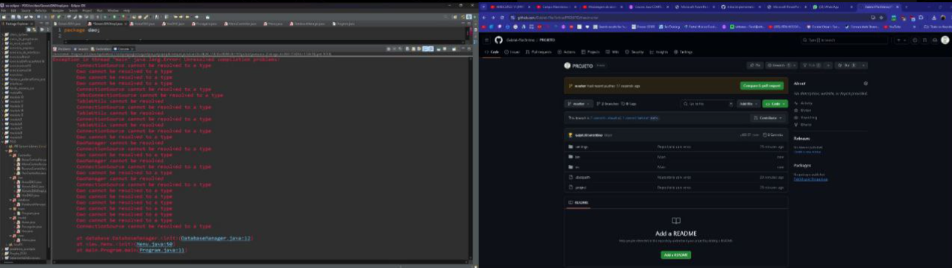
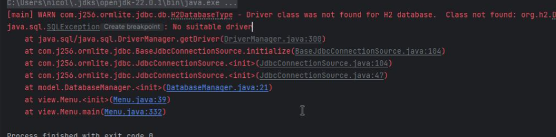

Não conseguindo importar o DataBase e algmas bibliotecas não estão rodando, criação do PassageiroDAO, e ainda não está cadastrando.
Feita uma reunião extra para finalizar o projeto.
Não aparecendo as reservas.

João Vitor realizou testes em diversas Classes para ver se havia algum erro: 

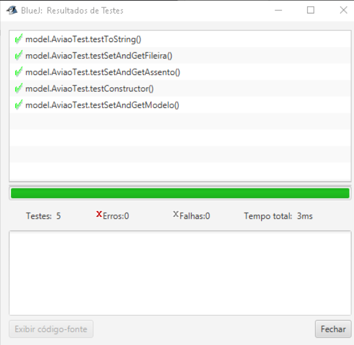
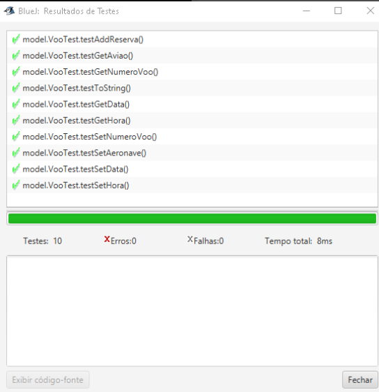
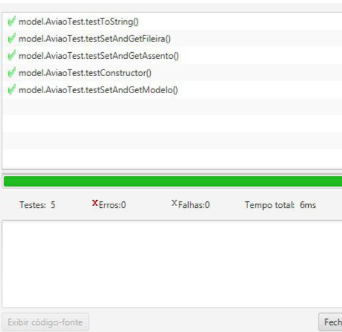

Problemas com o Bluej e JAVAFX, bugs com o ORMLITE e Banco de Dados e grande modificação do código .
Finalização do Diagrama UML ,adição de Getters e Setters em algumas Classes que estavam faltando, alterações na Documentação, algumas partes do código não tiveram funcionalidade então o João foi removendo-as.
Realização de outra reunião para finalizar.
Depois de 7 horas tentando, não conseguimos resolver o bud da  reserva e assim enviamos tudo o que faltava e os relatórios de cada um.